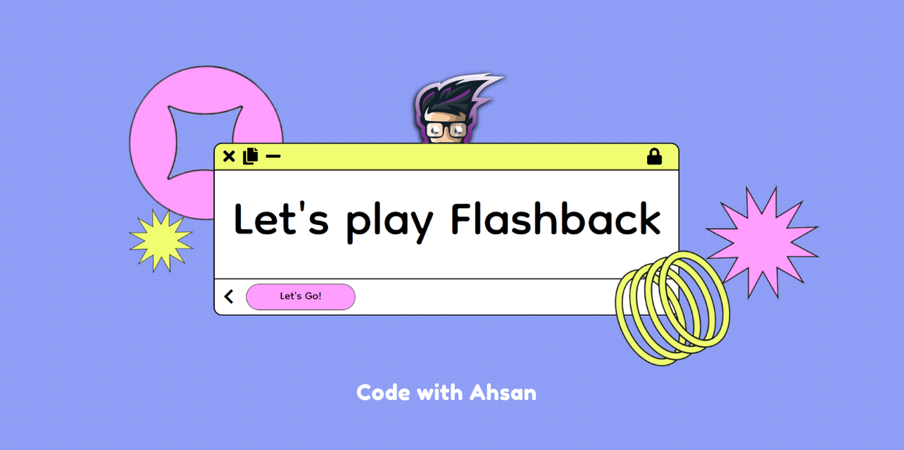

# Flashback

## Game Url (Demo)
<a href="https://flashback-3b0aa.web.app/">
https://flashback-3b0aa.web.app/
</a>

 

## About the game
This is a memory based game built for the MongoDB Atlas Hackathon. Players can create game lobbies and invite others using a link. They can simulataneously play the memory game and whoever finishes first, essentially wins and the game quickly ends as someone finishes the game as a winner.

## Built with
The game is built using Angular, TypeScript, TailwindCSS, NestJS, MongoDB 😄 (of course), and Firebase. Also, with a lot of and hardwork 💗. Which can be seen at either [Twitch](https://twitch.tv/codewithahsan) or [YouTube](https://youtube.com/CodeWithAhsan) as all of this was streamed LIVE with all my efforts, frustration, and small wins 😉.

## Where is everything hosted?
The frontend of the app is deployed to Firebase Hosting while the backend (NestJS) is deployed to Heroku.

## About me

  

    Hey everyone, I'm Ahsan and I'm a front-end focused Full-Stack JavaScript Engineer and author of [the Angular Cookbook](https://ahsanayaz.com/ng-book). Right now I'm working as a Software Architect at <a href="https://www.syncron.com/">Syncron</a> and a <a href="https://ahsanayaz.com/gde">Google Developers Expert in Angular</a>. I create video tutorials on <a href="https://ahsanayaz.com/youtube">YouTube Channel</a> and write articles at my blog <a href="https://codewithahsan.dev">https://codewithahsan.dev</a>. 
  

<h4 style="margin-bottom: 0">Like my work? </h4>

Or follow & connect with me on my Socials:

